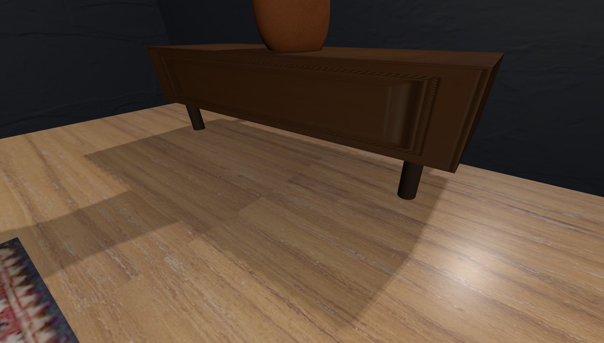

# SGI 2024/2025 - TP1

## Group T04G10
| Name             | Number    | E-Mail             |
| ---------------- | --------- | ------------------ |
| José Isidro         | 202006485 | up202006485@up.pt                |
| Bruno Machado         | 201907715 | up201907715@up.pt                |

## Project Information

The objective of this project is to create a simple THREE.js scene that utilizes primitive geometries, curves, transformation, materials, light, and shadows, as taught in our practical classes.

    
    
Figure 1: Project Overview

## Topics

- [Code Organization](#code-organization)
- [Controls](#controls)
- [Requirements](#requirements)
    - [Cameras](#cameras)
    - [Walls and Floor](#walls-and-floor)
    - [Table](#table)
    - [Plates](#plates)
    - [Cake and Candle](#cake-and-candle)
    - [Portraits](#portraits)
    - [Window](#window)
    - [Bettle's Painting](#bettle-painting)
    - [Spotlight](#spolight)
    - [Spring](#spring)
    - [Newspaper](#newspaper)
    - [Jar](#jar)
    - [Flower](#flower)
    - [Shadows](#shadows)
- [Extra](#extra)
    - [Lamps](#lamps)
    - [Chair](#chair)
    - [Carpet](#carpet)
    - [Cabinet](#cabinet)
    - [Door](#door)
    - [Painting Easel](#painting-easel)
- [Issues and Problems](#issuesproblems)

----

### Code Organization

For the sake of organization, we have created a `components`folder, which containing every object that composes our scene.

These objects are the declared in the `constructor` of MyContents.js and are  initialized and added to the scene in the `init` method.

---

### Controls

In order to customize the scene, we've developed a comprehensive control section for the user to modify the scene.

    
    
Figure 2: Controls

####  Camera Controls

1. Camera Perspectives: To simplify camera positioning, we offer different camera perspectives, including:
    1. Perspective
    2. Perspective2
    3. Left
    4. Right
    5. Top
    6. Front
    7. Back
3. Camera Coordinates: You can adjust the `x`, `y`, and `z` coordinates of the camera directly from the GUI settings.

You change the `diffuse`and `specular`colors of the floor and enable/disable its texture.

You can also change the `color`of the walls.

#### Lamps Controls

You can turn on/off the lamps. You can also change their color.

#### Window and Spotlight Controls

You can change the `intensity` of the window `RectAreaLight`.

You can change the `color`, `intensity` and `distance` of the spotlight, as well as ajusting its coordinates.

#### Table Controls

You can adjust the `size`of the table, and enable/disable it. You may also change its `coordinates`.

### Requirements

The following sections detail the project's work-related items and their fulfillment.

#### Cameras

For camera control, you can modify the `coordinates` to reposition the camera. As mentioned before, we've included different camera views for your convenience.

    
    
Figure 3: Top View

#### Walls and Floor

As required, the walls and the floor are created using planes. These objects are defined in `MyWalls` and  `MyFloor`, respectively. As mentioned before, the color of the walls and floor may be changed in the GUI.

    
    
Figure 4: Changing the Walls color

It's also worth mentioning the floor has a `MeshPhysicalMaterial`, which makes it possible to reflect the "natural" light coming from the window.

#### Table

The table is an object composed of a wooden-textured box geometry (on top) and four metalic-textured cylindrical legs (on the bottom).

    
    
Figure 5: Table

#### Plates

The plates consist of a cylindrical object with a plate-like texture.

    
    
Figure 6: Plates

#### Cake and Candle

The cake is modeled as a cylinder with a missing wedge to represent a slice. The top has a smooth texture to resemble frosted top, while the exposed slice features rectangular side planes with layered detailing. These sides help highlight the cake’s interior, resembling visible sponge and filling layers.

    
    
Figure 7: Cake

The candle is constructed with alternating colored segments, creating a striped pattern for a more realistic appearance. Each segment is a small cylinder, stacking up to form the candle body. The flame is represented as a small cone positioned at the top. The use of `THREE.CylinderGeometry` for the candle segments and `THREE.ConeGeometry` for the flame provides a simple representation of a lit candle.

#### Portraits

Each painting has a rectangular canvas base with a fabric-like texture and a light grey color. A photo is placed slightly above the canvas to create a layered effect. This setup gives each painting a realistic look and helps it stand out in the scene.

    
    
Figure 8: Portaits

#### Window

The window is composed by 3 main strutures: a glass-like box geometry on the front, a feup-texured plane behind the glass and a metal-like frame.

Additionally, there is a RectAreaLight projected on the floor, in order to simulate the natural light entering the room.

    
    
Figure 9: Window

#### Beetle's Painting

The Beetle drawing is represented as a 2D illustration on a canvas, combining a series of Bézier curves to shape the car's wheels, body, and hood. The Beetle is placed on a canvas mounted within a brown frame. This object leverages `THREE.CubicBezierCurve3`(Half circle) and `THREE.QuadraticBezierCurve3`(Quarter of circle) for the curves and `THREE.Line` for tracing each part of the car.

    
    
Figure 10: Beetle's Painting

#### Spotlight

To meet the project requirements, we've added a `Spotlight` pointing at the cake.
In the image below it's possible to see the shadow projected on the cake by the spotlight (as well as the shadow projected on the table by the Directional Light).

    
    
Figure 11: Spotlight: Cake

#### Spring

The spring consists of a spiraled path created with a sequence of points using `CatmullRomCurve3`, providing a smooth and natural coil structure. The path is then rendered with `TubeGeometry`, which wraps a cylindrical mesh along the path to give a realistic metallic appearence.

    
    
Figure 12: Spring

#### Newspaper

As required, the newspaper is designed with a curved surface. We've taken this a step further by creating two pages side by side to simulate an open newspaper.

    
    
Figure 13: Newspaper

#### Jar

As per the requirements, the jar is composed by two NURBS curved surfaces surfaces combined to form the jar. We've also added a circular object to simulate the dirt inside it.

    
    
Figure 14: Jar

#### Flower

The flower is generated using a `CatmullRomCurve3` from a path geometry. The stem is created using tube geometry, while the flower's circle is formed from a  sphere. The petals are designed using NURBS surfaces to achieve a petal-like appearance.

We've also added a texture to the petals to make them more realistic.

    
    
Figure 15: Flower

#### Shadows

Shadows have been added to the scene to make it look more dynamic. As required, the spotlight also casts a shadow on the table. The scene features lots of different lights and shadows in the scene. 

    
    
Figure 16: Shadows

 
--- 

### Extra

#### Lamps

We've also added 2 lamps. These lamps are objects composed 3 cylindrical objects: the base, pole and the top, which has different radiuses to accomplish this geometry.

Despite being off initially, these lamps can be turned on the control section, where their color can also be changed by the user.

    
    
Figure 17: Lamp

#### Chair

We've created a simple chair that has a geometry very similar to our table, with the addition of the back box.

    
    
Figure 18: Chair

#### Carpet

We decided to also add a carpet under the table, represented by a simple carpet-textured plane.

    
    
Figure 19: Carpet

#### Cabinet

The cabinet is once again based on the geometry of the table, but also contains a textured plane on the front to simulate the real furniture piece.

    
    
Figure 21: Cabinet

#### Door

The door consists of a simple box geometry with a door texture. But we've added a metalic sphere to mimic the door handle.

    
    
Figure 20: Door

#### Painting Easel

The easel is made up of two front legs and a rear support leg, along with two crossbars for stability. A textured canvas with the famous painting "The persistance of Memory" by Salvador Dalí, is mounted on the easel. The front assembly of the easel is slightly tilted for a realistic lean, and the legs are crafted using box geometries to provide thickness.

    
    
Figure 21: Painting Easel

----

## Issues/Problems

The main issue we've encountered was the the lack of an `Object` abstract class, for the other objects to extend. This would allow us to more easily control the object's position, as well as other common attributes.

In future projects, we intend to address this issue.

