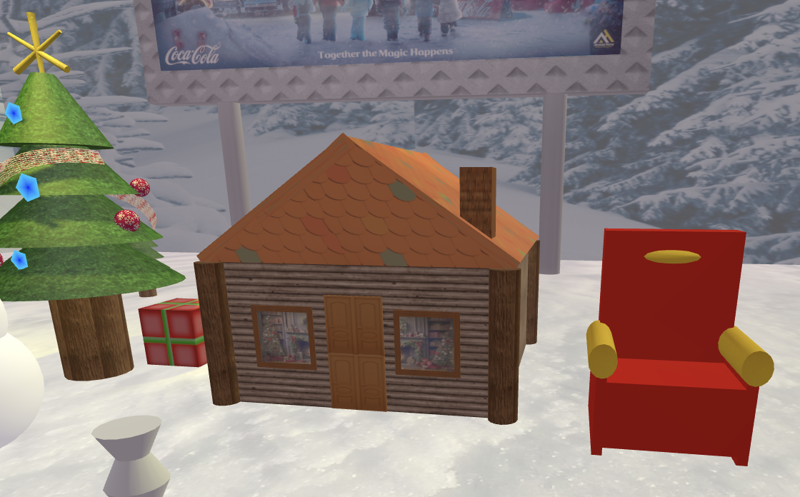
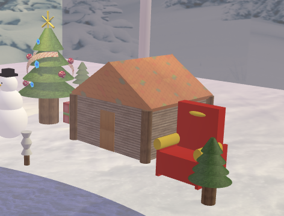

# SGI 2024/2025 - TP2

## Group T04G10
| Name             | Number    | E-Mail             | Work Distribution |
| ---------------- | --------- | ------------------ | --------- |
| José Isidro         | 202006485 | up202006485@up.pt                | 65% |
| Bruno Machado         | 201907715 | up201907715@up.pt                | 35% |

## Project Information

The objective of this project is to create a 3D Graphics Application, equipped with a graphics engine  that produces THREE.js scenes from a JSON file with the provided YASF (Yet Another Scene Format) specification.

    
    
Figure 1: Project Overview

## Topics

- [Code Organization](#code-organization)
- [Controls](#controls)
- [Scene](#scene)
- [Advanced Textures](#advanced-textures)
- [Level of Detail (LOD)](#level-of-detail-lod)
- [Issues and Problems](#issuesproblems)

----

## Code Organization

For the sake of organization, we have created 3 main folders: a `parser` folder, with our parser, MyFileReader, that reads and parses the scene json file; a `loaders` folder, with all of the loaders for the various components of our scene, from cameras and textures to objects and lights and finally an `objects` folder that contains the code for our base object classes.

These objects are the declared in the `constructor` of MyContents.js and are  initialized and added to the scene in the `init` method.

---

## Controls

In order to customize the scene, we've developed a comprehensive control section for the user to modify the scene.

    
    

    Figure 2: Controls - Main & Camera
    Figure 3: Controls - Objects

    
    

    Figure 4: Controls - Lights
    Figure 5: Controls - Materials

---

## Scene

Below, we'll illustrate a few examples of the use of all of the various primitives. These are not exclusive.

**Rectangle**

The rectangle primitive is used in our placard object.

    
    
Figure 6: Primitives - Rectangle

**Triangle**

The triangle primitive is used in the roof of our cabin (front and back).

    
    
Figure 7: Primitives - Triangle

**Box**

The box primitive is used in the presents, in the main strutucture of the house and also in the chair seat.

    
    
Figure 8: Primitives - Box

**Cylinder**

The cylinder primitive is used in the tree trunk.

    
    
Figure 9: Primitives - Cylinder

**Sphere**

The sphere primitive is used in the snowman body.

    
    
Figure 10: Primitives - Sphere

**Nurbs**

The nurbs primitive is used in the tree decoration.

    
    
Figure 11: Primitives - Nurbs

**Buffer Geomtry (Polygon)**

The polygon primitive is also used in the tree decoration, creating blue pentagons.

    
    
Figure 12: Primitives - Polygon

----

### Advanced Textures

We have implemented each and every new technique required for this work.

**Skybox**

    
    
Figure 13: Skybox

**Mipmaps**

Although not noticeable, mipmaps are being used in our christmas balls decorating the tree. For all other textures that don't specify their own mipmaps, our loaders generate them automatically.

**Bump Maps**

    
    
Figure 14: Bump Map (Snow)

**Video Textures**

    
    
Figure 15: Video Texture (River)

----

### Level of Detail (LOD)

We have a created a LOD for our cabin for the purpose of this demonstration. Below, you can observe the 3 levels of detail for the cabin.

    
    
    

Figure 16: Level of Detail - Cabin

---- 

## Issues/Problems

We had no major issues with this project and we believe we have accomplished all the requirements, through the creation of this beautiful christmas scene.

