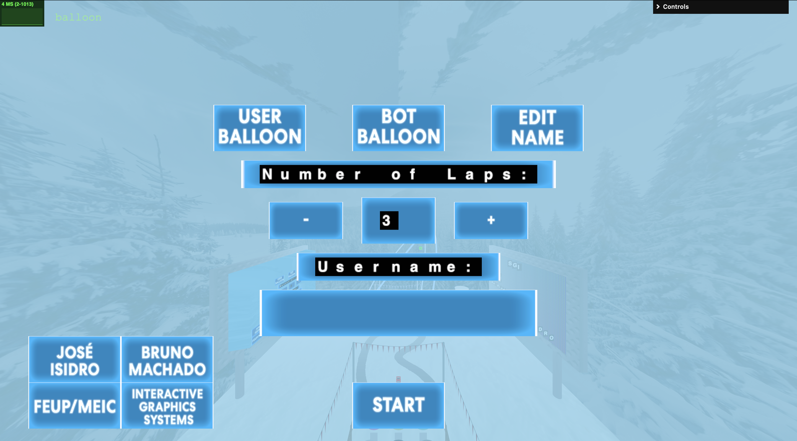
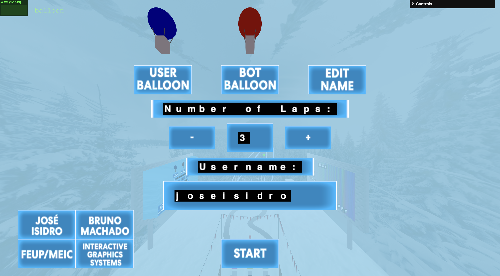
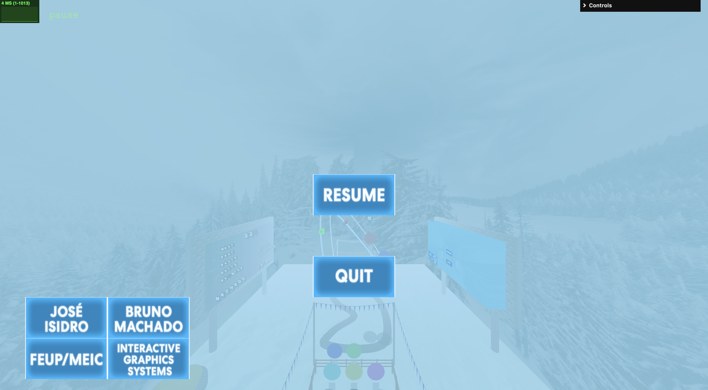
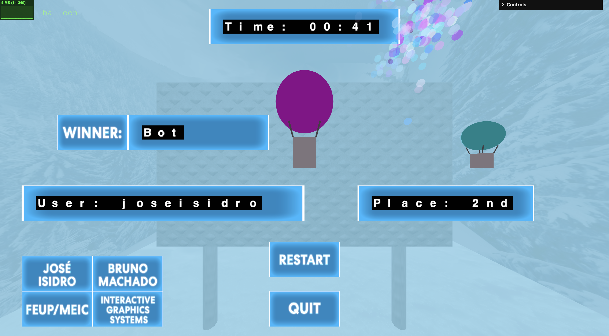
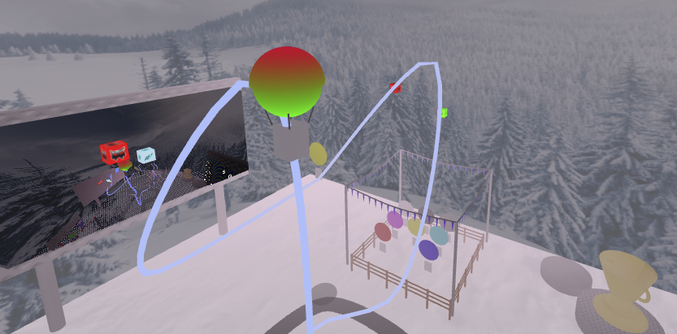
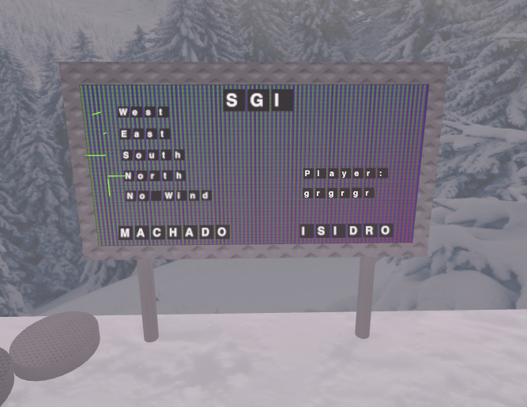
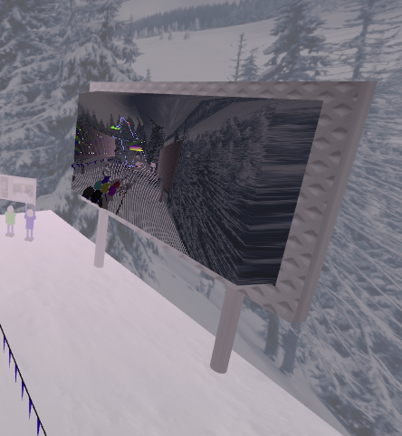
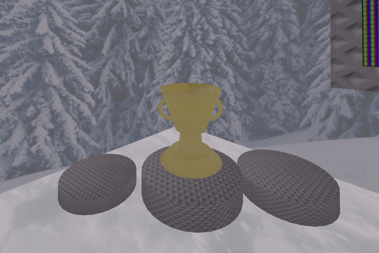

# SGI 2024/2025 - TP3

## Group T04G10
| Name             | Number    | E-Mail             | Work Distribution |
| ---------------- | --------- | ------------------ | --------- |
| José Isidro         | 202006485 | up202006485@up.pt                | % |
| Bruno Machado         | 201907715 | up201907715@up.pt                | % |

## How to Play

- **Choose User Balloon**: Press the `User Balloon` button to select your balloon from the available options. Select a balloon by clicking on it.
- **Choose Opponent Balloon**: Press the `Bot Balloon` button to select the opponent's balloon. Select a balloon by clicking on it.
- **Add Username**: Enter your username by pressing the `Edit Name` button or by pressing the empty name field in the middle of screen. Type in your username and press `ENTER` to save it.
- **Playing**: Navigate through the track, avoid obstacles, and collect power-ups. Press `W` and `S` to move your balloon up or down, respectively. Additionally, press `A` and `D` to turn your balloon to the left or right, respectively.
- **Pause**: Pause the game if needed by pressing and `P` key. Press `P` again or click the `Resume` button to resume the game. Press the `Quit` button to quit.
- **Free Mode**: Press `K` while in the Pause menu to move your camera freely. Press `K` again to exit this mode.
- **End**: Press `ESCAPE` at any given time to forfeit and end the game.

Enjoy the game!

## Game States

### Start
The initial state of the game where the main menu is displayed. The player can start the game, choose a username, select balloons, and configure the number of laps.

In this state, the player must enter their username. The username must be between 1 and 16 characters long.

### Choose User Balloon
The player selects their balloon from a list of available balloons. Each balloon has a unique color.

### Choose Opponent Balloon
The player selects the opponent's balloon from a list of available balloons. Each balloon has a unique color.

### Playing
The main gameplay state where the player controls their balloon, navigating through the track, avoiding obstacles, and collecting power-ups. The HUD displays relevant information such as wind direction, laps, position, vouchers, and time.

### Pause
The game is paused, and the pause menu is displayed. The player can resume the game or quit the game, forfeiting the match.

### End
The game has ended, and the end menu is displayed. The player can see their final time, position, and the winner. The player can restart the game with the same settings or quit to the main menu.

## Game Features and Objects

### Balloon & Objects Shaders

As the balloon ascends, a dynamic inflation effect simulates the balloon expanding, with its topgradually turning red to indicate rising altitude and pressure. Conversely, as the balloon descends, it deflates back to its normal dimensions, with the top fading to blue, representing cooling and reduced altitude. Also obstacles and power-ups dynamically inflate over time, creating a sense of growth and movement in the environment. 

  

### Outdoor Display 

The outdoor display acts as a information hub, showcasing essential gameplay details. Using sprites, the display  presents the player's alongside, wind directions are visualized with intuitive arrows and labeled text, providing players with insights into environmental factors that influence gameplay.

  

### 3D Outdoor display

The enhanced outdoor display introduces a captivating three-dimensional bas-relief effect by combining RGB and greyscale images. The greyscale image, representing depth information, dynamically displaces vertices to create a realistic bas-relief texture.

  

### Scene extra elements

The scene is enriched with extra elements that add depth and personality to the environment. A podium  stands with a shining cup on top. 

  

As well, as some fans holding a poster featuring the images of contributors.

  

